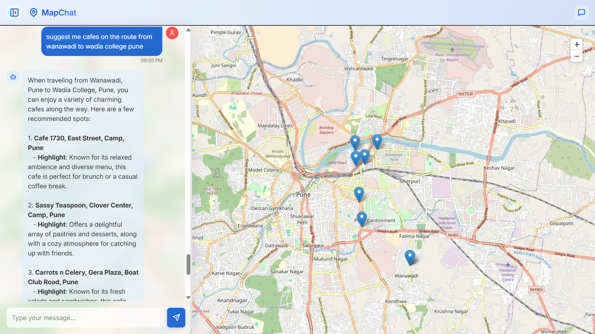
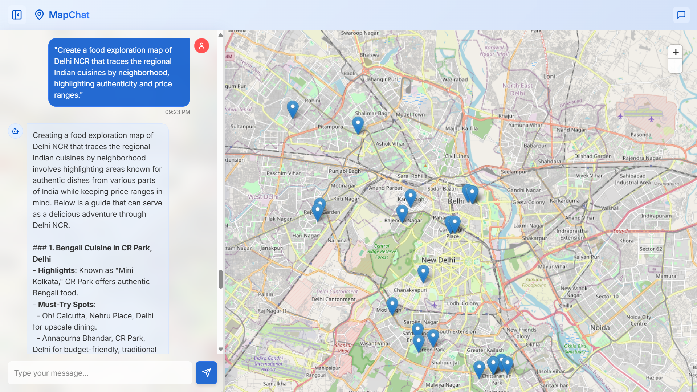
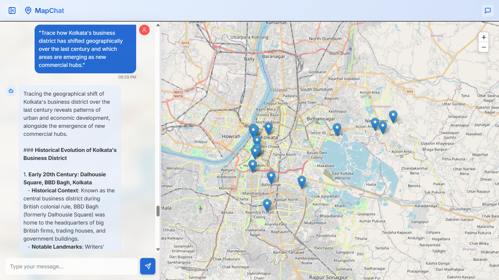
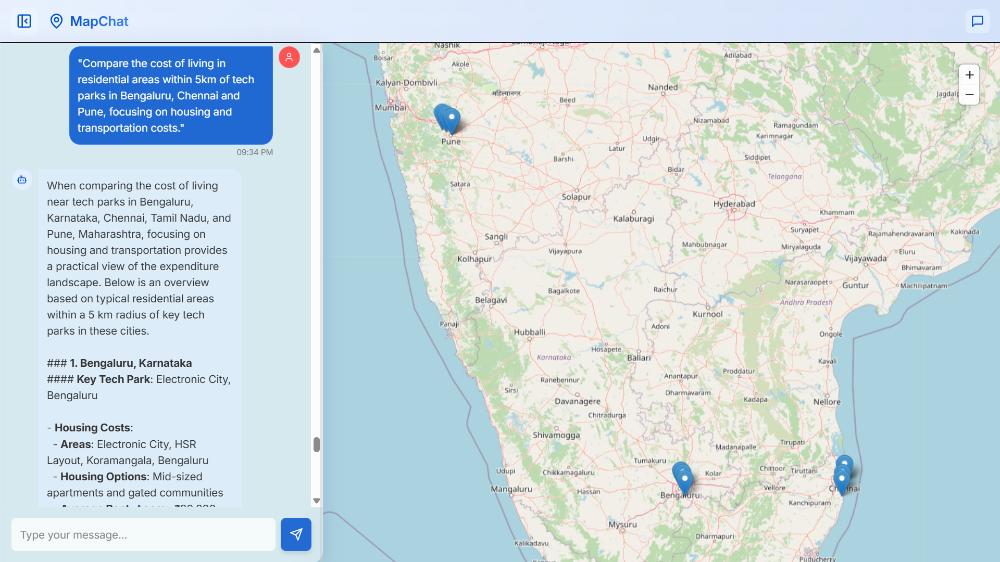
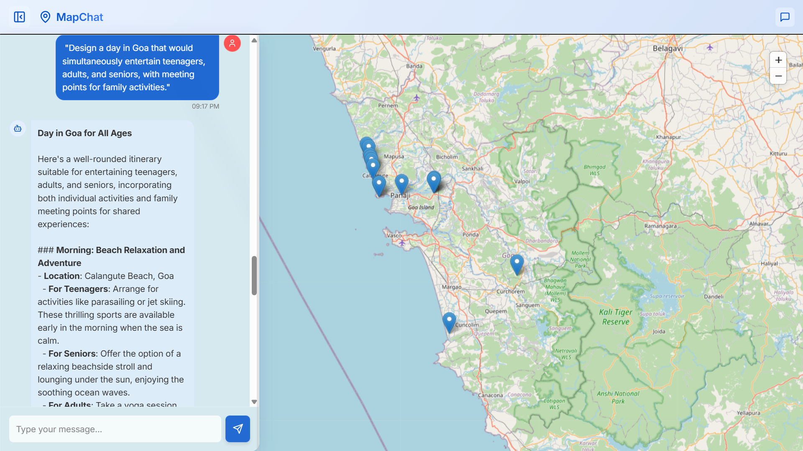

# Context-Aware Geospatial Data Retrieval using LLMs

A sophisticated web application that leverages Large Language Models (LLMs) to provide intelligent, context-aware geospatial data retrieval and visualization. This project combines natural language processing with interactive mapping to create an intuitive interface for location-based queries.

## Features

- **Natural Language Processing**: Interact with the system using everyday language to query location information
- **Context-Aware Responses**: Maintains conversation history for more relevant and contextual responses
- **Real-time Geocoding**: Converts location names to precise coordinates using Google Maps API
- **Interactive Map Visualization**: Dynamic map interface that updates based on location queries
- **Real-time Data Retrieval**: Access current information about locations using SerpAPI
- **Responsive UI**: Modern, user-friendly interface with collapsible sidebar

## Output Samples

### Sample 1: Location Query and Response

*Query about restaurants with map visualization*

### Sample 2: Multiple Location Display

*Displaying multiple locations with detailed information*

### Sample 3: Interactive Map Features

*Interactive map with location markers and information*

### Sample 4: Context-Aware Response

*Context-aware response with location details*

### Sample 5: Real-time Data Integration

*Real-time data integration with map visualization*

## Tech Stack

### Backend
- Python 3.x
- Flask (Web Framework)
- OpenAI GPT-4 (LLM Integration)
- Google Maps Geocoding API
- SerpAPI (Real-time Data)
- Agno Framework (LLM Agent Management)

### Frontend
- React
- TypeScript
- Tailwind CSS
- Interactive Map Component
- Vite (Build Tool)

## Getting Started

### Prerequisites
- Python 3.x
- Node.js and npm
- API Keys for:
  - OpenAI
  - Google Maps
  - SerpAPI

### Installation

1. Clone the repository:
```bash
git clone https://github.com/yourusername/geospatial-llm.git
cd geospatial-llm
```

2. Backend Setup:
```bash
cd backend
python -m venv venv
source venv/bin/activate  # On Windows: venv\Scripts\activate
pip install -r requirements.txt
```

3. Frontend Setup:
```bash
cd frontend
npm install
```

4. Environment Variables:
Create a `.env` file in the backend directory with:
```
OPENAI_API_KEY=your_openai_api_key
GOOGLE_MAPS_API_KEY=your_google_maps_api_key
SERPAPI_KEY=your_serpapi_key
```

### Running the Application

1. Start the Backend:
```bash
cd backend
python server.py
```

2. Start the Frontend:
```bash
cd frontend
npm run dev
```

The application will be available at `http://localhost:5173`

## Usage

1. Open the application in your web browser
2. Type your location-based query in the chat interface
3. The system will:
   - Process your query using the LLM
   - Extract relevant locations
   - Convert locations to coordinates
   - Display the locations on the interactive map
   - Provide detailed information about the locations

Example queries:
- "Show me the best restaurants in Pune"
- "What are the popular tourist spots in Mumbai?"
- "Find hospitals near Koregaon Park"
- "Plan 3 days trip to Goa."

## Configuration

The system can be configured through various environment variables and settings:

- `num_history_responses`: Number of previous responses to maintain for context (default: 4)
- Map default center and zoom level can be adjusted in `App.tsx`
- LLM model parameters can be modified in `agent.py`

## License

This project is licensed under the MIT License - see the LICENSE file for details.

## Citation

If you use this project in your work, please cite it as follows:

```bibtex
@software{geospatial_llm_2024,
  author = {Aditya Shingote, Shishir Narkhede, Sunil Kumawat, Kaushal Borkar,},
  title = {Context-Aware Geospatial Data Retrieval using LLMs},
  year = {2024},
  url = {https://github.com/Sunilk240/geospatial-llm}
}
```

Or simply mention us in your acknowledgments:
```
This project uses the Context-Aware Geospatial Data Retrieval system developed by Aditya Shingote, Shishir Narkhede, Sunil Kumawat, and Kaushal Borkar.
```

## Authors

- [Aditya Shingote](https://github.com/addy-codes1)
- [Shishir Narkhede](https://github.com/Shishir-grez)
- [Sunil Kumawat](https://github.com/Sunilk240) 
- [Kaushal Borkar](https://github.com/kaushal13) 

## Acknowledgments

- OpenAI for GPT-4 API
- Google Maps Platform
- SerpAPI
- Agno Framework
- React and TypeScript communities 